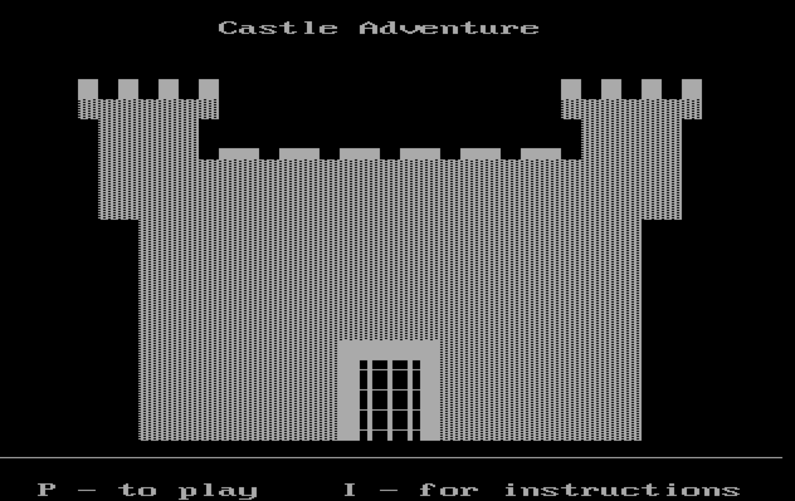
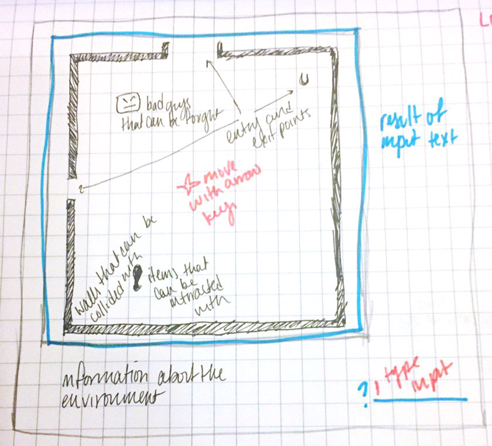

####_J Silverstein / 12.13.16_
#Castle Adventure Proposal

##What is Castle Adventure?
- Castle Adventure is an old freeware/shareware DOS game. Built in 1984 by teenaged programmer Kevin Bales, it quickly spread. Today, it still occupies a place of fond nostalgia for many of us who started playing computer games in the DOS era, but has never been replicated fully for the modern internet browser.
- For more information, see [The Key to the Castle](http://www.thealmightyguru.com/Reviews/CastleAdventure/CA-TheGame.html)

## Wireframe

| Element | Aspects |
| --- | --- |
| Base | Canvas, browser window |
| Player input | Input field; player icon (moved with arrow keys) |
| Game output (interactable) | *Room* (walls, entry & exit points, player position); *objects* (can be picked up & looked at); *monsters* (can be fought); player initial position |
| Game output (static) | Room description; result of input field; list of objects in room |

## Initial thoughts on game building
<dl>
<dt>Classes and objects</dt>
<dd>I am thinking that the easiest way to create a room that loads when the player reaches a certain point is having a set of x/y entry and exit coordinates. When the user reaches the x/y coordinates, it triggers an object creation from class Room (or, eventually, corridor / maze) that redraws the canvas. <i>Problem: I foresee running into the conundrum "How do you create a class object using an existing object as an argument?" I've looked into this already in relation to another project I've been thinking about and have come up with nothing.</i></dd>
<dt>Items & input</dt>
<dd>The original game's parser wasn't very sophisticated; it shouldn't be hard to come up with a way of searching a string for certain keywords and comparing them to the list of items. A rudimentary version of this already exists, although I need to link the item and the user's action.</dd>
<dt>Monsters</dt>
<dd>Originally, the monsters' speed and fight power was determined by the computer's processing speed -- of course, this is going to be handled a little differently -- perhaps on a collision event the user or the monster's "hit points" will be decreased. The more difficult conundrum is going to be figuring out how to make a monster that can "see" the user if there's nothing between it and the user.</dd>
<dt>User</dt>
<dd>I am having a tough time conceptualizing the player's position and how it's reloaded in each new room, especially rooms that have multiple entry points.</dd>
<dt>Points & context-specific actions</dt>
<dd>Return to these once level 2 is reached.</dd>
</dl>

## Levels of completion
#### Level -2
- Two rooms
- Player can move betwen rooms
- Rooms have walls that can be collided with and entry/exit points

#### Level -1
- A full "floor" of rooms (5-10)
- Addition of objects that can be interacted with and interacted upon
- ***Win scenario***

#### Level 0
- Upstairs & downstairs entry points (15-20 rooms)
- Addition of context-specific object actions (i.e. if you're wearing the necklace you don't drown in the basement)
- ***Loss scenario***

#### Level 1
- Addition of ogres to fight... ogres will need their own initial-position and speed. 
- ***Fight-based loss scenario***
- Easter egg: keycode combo that will make the monster run at the CPU's speed

#### Level 2
- Addition of maze rooms
- Fairy and Vampire-type monsters

#### Level 3
- Expansion of game - up to 40 rooms
- Scoring system

#### Level 4
- Exact, complete duplicate of original game
- Memory of high score

#### Level 5 _Castle's Sky_
- Generative version of the game - rooms are created on the fly without being specifically defined. Sort of like a very low-level version of No Man's Sky.

## Links and Resources
- [jCanvas](http://projects.calebevans.me/jcanvas/)
- [Passing object as a parameter](http://stackoverflow.com/questions/4743030/passing-object-as-parameter-to-constructor-function-and-copy-its-properties-to-t)
- [JSFiddle on canvas key motion](http://jsfiddle.net/epistemex/r63Nh/)
- [JSFiddle on keyup, keydown, keypress](http://jsfiddle.net/zG9MF/2/)